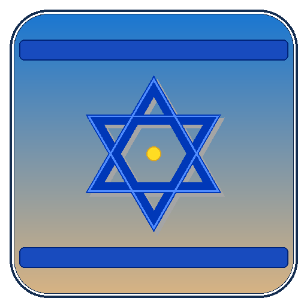

# Israel-Simulator

<p align="center">
  
</p>

<p align="center">
  <strong>An open-world Minecraft Java Edition expansion exploring Israeli environments, living cities, cultural traditions, dynamic economies, and chaotic sandbox encounters.</strong>
</p>

<p align="center">
  <a href="https://neoforged.net/"></a>
  <a href="https://minecraft.net/"></a>
  <a href="https://adoptium.net/"></a>
  <a href="LICENSE"></a>
  <a href="https://github.com/TCDev10/Israel-Simulator/actions/workflows/build.yml"></a>
  <a href="https://github.com/TCDev10/Israel-Simulator/releases"></a>
</p>

---

## Table of Contents

- [Overview](#overview)
- [Key Features](#key-features)
  - [Deterministic Biomes & World Generation](#-deterministic-biomes--world-generation)
  - [16 Procedural Real Structures](#-16-procedural-real-structures)
  - [Dynamic Cities & Tel Aviv District System](#-dynamic-cities--tel-aviv-district-system)
  - [Living Cultural & Religious Mechanics](#-living-cultural--religious-mechanics)
  - [Currency, Economy & Food](#-currency-economy--food)
  - [Endgame & Sandbox Encounters](#-endgame--sandbox-encounters)
- [Installation Guide](#installation-guide)
  - [Client (Singleplayer & Multiplayer)](#client-singleplayer--multiplayer)
  - [Dedicated Server](#dedicated-server)
- [Building from Source (Developer Guide)](#building-from-source-developer-guide)
  - [Prerequisites](#prerequisites)
  - [Compiling the Mod JAR](#compiling-the-mod-jar)
  - [Running Development Client / Server](#running-development-client--server)
  - [Running the Test Suite](#running-the-test-suite)
- [Project Architecture](#project-architecture)
- [Contributing](#contributing)
- [Localization](#localization)
- [License & Credits](#license--credits)

---

## Overview

**Israel-Simulator** is a sandbox mod built for **NeoForge 26.2** (targeting **Minecraft 26.2** on **Java 25**). Rather than being a linear adventure map or a scripted tour, the mod proceduralizes the landscape of Israel into Minecraft's native world generation.

It combines two core experiences:
1. **Authentic Cultural Simulation**: Walk the limestone alleys of Jerusalem's Old City, pray at the Western Wall with a Kippah and Prayer Note, light the Hanukkah Menorah, celebrate Shabbat, sample street food (falafel, shakshuka, sabich, hummus), and trade using Shekels and Rav-Kav transit cards.
2. **Chaotic Sandbox Gameplay**: Discover ancient desert sanctuaries holding the mythic *Rabbi's Crown*, venture into tech startups in Tel Aviv, battle the satirical *Bibi* boss and his security guards, and play the legendary *Hava Nagila* music disc.

Every mechanic is built from the ground up to be **authoritative on the server**, ensuring fair multiplayer environments without client-side exploit vectors.

---

## Key Features

### 🌍 Deterministic Biomes & World Generation

The mod organizes Israeli biomes into an intuitive West-to-East geographic strip at depth `0.0`:
* **Mediterranean Coast**: Sandy shorelines, warm waters, palm flora, and maritime climate.
* **Urban Area**: Modern metropolitan terrain, paved transit grids, and bustling plazas.
* **Israeli Agriculture**: Fertile terraced fields, olive groves, and vineyards producing custom grapevine crops.
* **Jerusalem Highlands**: Rugged limestone hills, ancient pathways, and Jerusalem Stone bedrock.
* **Judean Desert**: Arid sandstone valleys, canyons, oasis pockets, and harsh survival conditions.
* **Dead Sea**: Deep salt-crusted depression with salt blocks, mineral water, and extreme elevation drops bordering Jerusalem and the desert.

### 🏛️ 16 Procedural Real Structures

All 16 registered structures feature complete, hand-tuned procedural NBT architectures with furnished interiors, functional block entities, and dedicated chest/barrel loot tables:

| Structure | Dimensions | Key Highlights |
| :--- | :--- | :--- |
| `western_wall` | 54×19×18 | Sacred limestone plaza, underground prayer tunnels, note crevices |
| `tel_aviv_city` | 48×18×48 | Multi-district urban complex with high-rises and boulevards |
| `jerusalem_city` | Jigsaw Assembly | Dynamic 12-piece Old City (bazaars, houses, arches, alleys, walls) |
| `great_synagogue` | 36×18×36 | Stained glass halls, central bimah, Torah Ark, vaulted ceiling |
| `ancient_sanctuary` | 30×12×34 | Hidden desert temple guarding the Mythic Rabbi's Crown |
| `grand_market` | 32×12×30 | Lively covered shuk stalls, spice crates, produce barrels |
| `government_building` | 28×14×26 | Civic halls, debating chambers, executive offices |
| `startup_office` | 26×14×26 | Modern tech hub with laptops, monitors, server racks |
| `synagogue` | 26×13×26 | Traditional neighbourhood house of prayer and study |
| `historical_house` | 24×11×24 | Heritage limestone multi-floor residential home |
| `agricultural_farm` | 32×12×32 | Modern greenhouses, irrigated crop plots, barn storage |
| `dead_sea_resort` | 36×10×32 | Seaside spa pavilions, mineral mud pools, tourist lounges |
| `desert_ruins` | 28×14×28 | Weathered sandstone arches, colonnades, buried treasure vault |
| `ein_gedi_oasis` | 32×16×32 | Natural mountain waterfall, lush palm pools, hidden cavern loot |
| `jaffa_port` | 40×14×36 | Sea docks, fishing warehouses, maritime cargo crates |
| `mediterranean_village` | 40×14×40 | Coastal village square, stone homes, coastal clock tower |

*Structure set placement and spacing are optimized for lightning-fast `/locate` searches without freezing chunk generation.*

### 🏙️ Dynamic Cities & Tel Aviv District System

When walking through Tel Aviv, players traverse **6 functional districts**, each greeted with a real-time HUD actionbar banner and unique economic multipliers:
- **Startup District**: Hub for tech items; boosts electronic trades and laptop rewards.
- **Rothschild Boulevard**: Financial spine with banking bonuses and cafe commerce.
- **Florentin**: Artistic quarter with artisan workshops and street market bargains.
- **Sarona**: Culinary market sector offering food item discounts and specialty stalls.
- **Promenade**: Seaside beachfront enhancing fishing trade values and leisure items.
- **White City**: Bauhaus architectural zone with cultural heritage bonuses.

### 🕍 Living Cultural & Religious Mechanics

- **Western Wall Prayer**: Equip a Kippah (head armor slot) and right-click the Western Wall with a *Prayer Note*. The server processes the prayer, consumes the note, plays celebratory sounds, spawns holy particles, and grants the *Blessed Effect* (Luck II + Regeneration I) alongside 5 Diamonds (with an anti-exploit cooldown).
- **Menorah Lighting**: Placeable multi-state Menorah block that can be progressively lit candle by candle during holiday festivals.
- **Synagogue Torah Ark**: Interactive holy ark providing community blessings to gathered worshippers.
- **Kosher Digestion System**: Dietary status effects rewarding proper kosher food combinations.
- **Holiday Calendar Events**: Scheduled in-game world events for Shabbat and Hanukkah.

### 💰 Currency, Economy & Food

- **Currency**: Minted **Shekel** and **Agora** coins with server-authoritative exchange rates and merchant discounts.
- **Public Transport**: **Rav-Kav** smart cards and transport stop blocks providing rapid transit across distant cities.
- **Mediterranean Cuisine**: 12 custom foods with original textures and realistic nutrition values:
  - *Falafel*, *Shakshuka*, *Sabich*, *Hummus*, *Challah*, *Matzo*, *Sufganiyah*, *Hamantash*, *Rugelach*, *Tahini*, *Olives*, *Citrus*, and fresh vineyard *Grapes*.

### ⚡ Endgame & Sandbox Encounters

- **Rabbi's Crown** *(MYTHIC)*: Ultra-rare sacred crown found exclusively within the deep chambers of the *Ancient Sanctuary*.
- **First Amendment** *(LEGENDARY)*: High-tier artifact granting speech and immunity effects.
- **Hava Nagila Music Disc** *(LEGENDARY)*: Custom music disc with full jukebox audio integration.
- **Bibi Boss Battle**: Satirical boss entity with custom AI goals, armed security guards, speech sound effects, and unique endgame drops.

---

## Installation Guide

### Client (Singleplayer & Multiplayer)

1. Make sure you have **Minecraft Java Edition 26.2** installed.
2. Download and install **[NeoForge 26.2.0.88+](https://neoforged.net/)**.
3. Download the latest `israel_simulator-x.y.z.jar` from the [GitHub Releases](https://github.com/TCDev10/Israel-Simulator/releases) tab.
4. Place the downloaded `.jar` file into your `.minecraft/mods` directory:
   - **Windows**: `%appdata%\.minecraft\mods`
   - **Linux**: `~/.minecraft/mods`
   - **macOS**: `~/Library/Application Support/minecraft/mods`
5. Select the NeoForge profile in the Minecraft Launcher and launch the game.

### Dedicated Server

1. Set up a standard NeoForge 26.2 dedicated server.
2. Ensure the server runs on **Java 25** (`java -version`).
3. Place `israel_simulator-x.y.z.jar` into the server's `mods/` directory.
4. Start the server via `run.bat` or `run.sh`. World generation rules and city structures will automatically generate in newly explored chunks.

---

## Building from Source (Developer Guide)

### Prerequisites

- **Java Development Kit (JDK) 25** or higher (e.g. Eclipse Temurin 25).
- **Git**.

### Compiling the Mod JAR

Clone the repository and build using the committed Gradle wrapper:

```bash
# Clone the repository
git clone https://github.com/TCDev10/Israel-Simulator.git
cd Israel-Simulator

# Compile, run automated verification, and package the release JAR
./gradlew build
```

The resulting mod JAR will be located at:
```text
build/libs/israel_simulator-0.1.0.jar
```

### Running Development Client / Server

NeoForge ModDevGradle comes preconfigured with dedicated run configurations:

```bash
# Launch a development Minecraft client with the mod loaded
./gradlew runClient

# Launch a headless development dedicated server
./gradlew runServer

# Run automated GameTest server
./gradlew runGameTestServer
```

### Running the Test Suite

Israel-Simulator enforces strict test coverage across all worldgen algorithms, registries, economies, and data assets:

```bash
# Run all 54 JUnit 5 test suites (249 tests)
./gradlew test
```

Test reports are generated in HTML format under `build/reports/tests/test/index.html`.

For manual in-game testing, beta checklist, scenario walkthroughs, and cheat sheet commands, consult the [Beta Testing Checklist (TESTING_GUIDE.md)](TESTING_GUIDE.md).

---

## Project Architecture

The codebase follows a modular server-authoritative structure:

```text
src/main/java/com/israelsimulator/
├── IsraelSimulator.java          # Mod entrypoint & event bus registrations
├── city/                         # City simulation & Tel Aviv district logic
│   ├── telaviv/                  # District boundaries, banners, economy multipliers
│   ├── jerusalem/                # Old City bazaar trades and economy
│   └── jaffa/                    # Port merchant trades and maritime economy
├── cultural/                     # Cultural interaction handlers (Western Wall, Menorah)
├── entity/                       # Custom entity definitions, AI goals, Bibi boss
├── event/                        # World events, festivals, player join/tick listeners
├── food/                         # Kosher digestion and nutrition handlers
├── registry/                     # NeoForge deferred registers (Blocks, Items, Entities, etc.)
└── world/                        # Climate parameters, biomes, jigsaw pools, structure sets
```

---

## Contributing

Contributions from the community are warmly welcome! Whether you are designing new jigsaw pieces, fixing bugs, or adding localizations:

1. **Fork the Repository** and create a descriptive branch:
   ```bash
   git checkout -b feature/my-cool-feature
   ```
2. **Follow Architectural Rules**:
   - Keep gameplay authoritative on the server (never trust client-supplied progression).
   - Use Minecraft data-driven registries (JSON structures, loot tables, tags) where appropriate.
   - Use original or compatibly licensed assets (AGPL-3.0 compatible).
3. **Verify Before Submitting**:
   - Ensure `./gradlew test` passes with zero failures.
   - Ensure `./gradlew build` builds cleanly.
4. **Open a Pull Request** describing your changes and testing steps.

---

## Localization

Israel-Simulator features complete dual-language support with 100% key parity:
* **English (`en_us`)**
* **Italian (`it_it`)**

Want to translate Israel-Simulator to Hebrew (`he_il`), Spanish (`es_es`), or another language? Simply copy `src/main/resources/assets/israel_simulator/lang/en_us.json` to your language code and submit a Pull Request!

---

## License & Credits

- **Code & Assets**: Licensed under the **[GNU Affero General Public License v3.0](LICENSE)** (AGPL-3.0).
- **Third-Party Credits**: See [CREDITS.md](CREDITS.md) for toolchain and library attribution.
- **Asset Licenses**: See [ASSET_LICENSES.md](ASSET_LICENSES.md) for licensing details of textures and audio.
